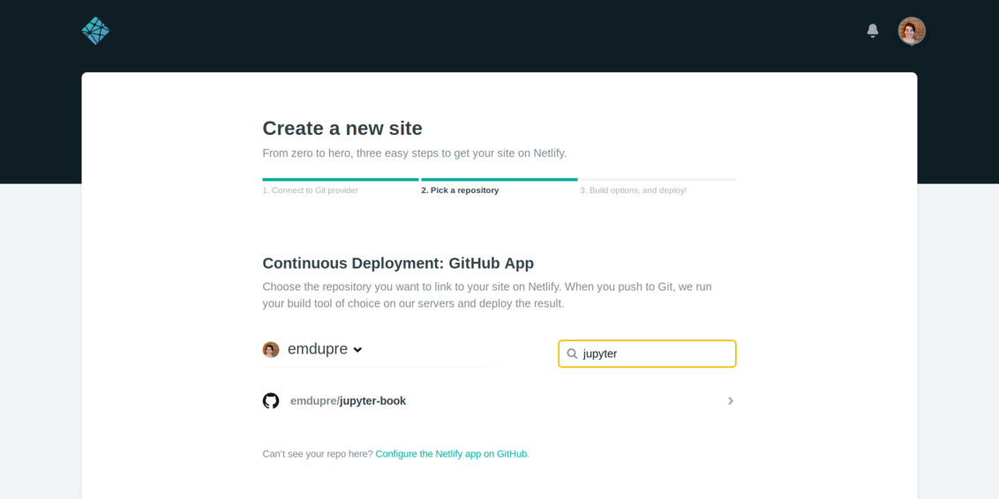
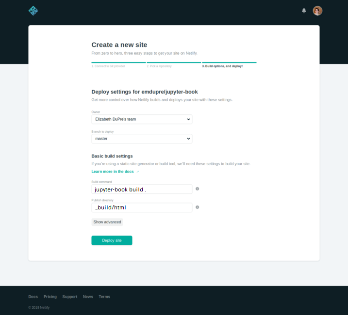
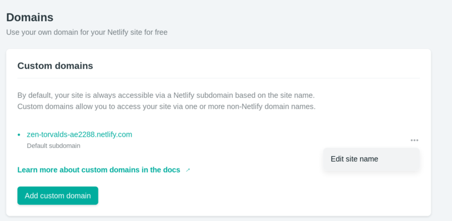

# Publish with Netlify

[Netlify](https://www.netlify.com/) is a continuous deployment service that can
**automatically build an updated copy of your Jupyter Book** as you push new content.
It can be used across git clients including GitHub, GitLab, and Bitbucket.

Note that these instructions assume you're keeping your source files under version-control,
rather than the built Jupyter Book HTML.
If you're pushing your HTML to GitHub,
you'll want to {doc}`host your book on GitHub Pages <../gh-pages>` instead.

Although Netlify has both free and paid tiers, the build process is the same across both.
Importantly, the free tier only allows for 100GB of bandwidth usage per month across all of your Netlify built projects.

```{margin}
If your Jupyter Book will be used by a large audience, or if you're creating many Jupyter
Books, you might want to consider registering for [a paid account](https://www.netlify.com/pricing/).
```

In order to use Netlify, you'll need to [create an account](https://app.netlify.com/signup).
Here, we'll walk through connecting your Jupyter Book to Netlify's continous deployment services using their UI.
You can also check out their [documentation on continuous deployment](https://www.netlify.com/docs/continuous-deployment/).

```{warning}
The default Netlify python environment is python 2.7.
You should update the python environment by including a `runtime.txt` file in your repository,
as detailed in [the Netlify documentation](https://www.netlify.com/docs/build-settings/#build-environment-variables).

For a full list of available environments,
please see the [Netlify build image details](https://github.com/netlify/build-image/blob/xenial/included_software.md#languages).
```

## Step 1: Connect your GitHub repo to Netlify

After you've created a Netlify account, you'll need to log in.
The home page will be a dashboard of all sites you're currently building with Netlify.
We can then import a new site by clicking the "New Site from Git" button in the upper right.

This should launch [the site builder](https://app.netlify.com/start):


Here, you can select the git client where your Jupyter Book is hosted.
For the purposes of this tutorial, we'll assume that your book is hosted on GitHub.

When you select the "GitHub" option, you'll be asked to grant permission for Netlify to access your GitHub account.
Authorizing access will take you to the next step of the build process, where you can select your Jupyter Book repository.



## Step 2: Add the command to install and build your book

```{margin}
If your book content is not in the root of your repository, make sure you point to it
in the `jupyter-book build` command.
```

Once you've selected the correct repository, you'll need to supply build instructions.
This is a command that Netlify runs before hosting your site. We'll use it to do the
following:

* Install Jupyter Book and your book's dependencies
* Build your book's HTML

Assuming that your book's dependencies are in a `requirements.txt` file,
**put the following command in the *Build command* section**:

```bash
pip install -r requirements.txt && jupyter-book build .
```

```{note}
Ensure that Jupyter Book's version in your `requirements.txt` file is at least
`0.7.0`.
```

Finally, the *Publish directory* should be `_build/html`.

You'll also need to select the appropriate branch to build your repository from.
In this example, we'll use the `master` branch.



You can then select *Deploy site* and wait for the site to build.
You'll be re-directed to the site dashboard during the build process.

## Step 3: Updating your domain name

If your site has successfully built, it will be assigned a random domain name.
In order to have a more memorable address, you can update your site's name.

From the site dashboard, select *Domain settings*.
This will take you to a sub-menu, where you can choose to update your site name.



You can enter a memorable, unique name here to describe your Jupyter Book!
Note that it will be prepended to `.netlify.com` so, `MY-BOOK` will become `MY-BOOK.netlify.com`.

You can also use a custom domain (i.e., one that you have purchased through a DNS registrar).
See the [Netlify documentation on custom domains](https://www.netlify.com/docs/custom-domains/) for more details on this process.
